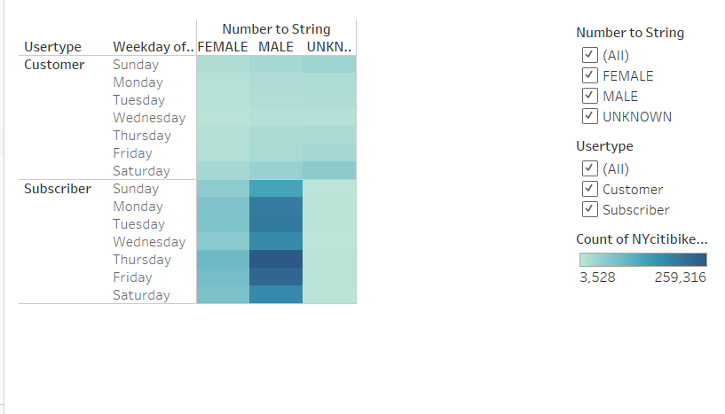

# bikesharing
Tableau analysis and visualization for proposal of bike sharing company
# bikesharing
Tableau analysis and visualization for proposal of bike sharing company
## Overview of the analysis
This project consist of data analysis and visualization of NY city bike ride dataset using Tableau. Purpose of this visualization is to convince candidates about starting bike share initiative in Des Moine and this project works as an proposal which contain various charts and graphs prepared by Tableau using 2019 NY City bike trip data. 
## Results
### Checkout Time by Users

This graph shows most of the bikes are checked out within 5 to 7 minutes of trip duration. 

### Checkout Time by Gender

Male population has dominetly using more bikes and lasted for around 5 to 6 minutes while female lasted for same time as men but number of female users are less in comparison. 

### Trips by weekday Hour

During weekends, peak hours are 10 am to 4 pm while on weekdays, majority of users are identified in morning time from 8 am to 10 am and in evening time when offices, schools are finished by 5 pm to 7 pm. 

### Trip Duration by Gender Weekday Hour

This heat map represents high number of male population during weekends than weekdays and also high during evening time between 5pm to 7pm. While on the other side, females use bikes during same time as men but in lesser quantity. 

### Trips by Usertype Gender

This graph shows that male subscribers are relatively higher and use bikes almost all days mostly on Fridays and saturdays while customers are comparatively very low than subscribers. 

## Summary
This analysis represents:
- Bike ride popularity in NY city by gender type.
- Trip duration by days and also by time during the day.
- User type count i.e. loyal subscribers and temporary customers of NY bike city data.
Recommended visualization for future:
- Count of Trip as per age group.
- complaints and reviews data of subscribers of NYcity for bike ride. 

[link to Citi Bikesharing dashboard](https://public.tableau.com/app/profile/priyanka.shetye7842/viz/keyoutcomesoftheNYCCitibikeAnalysis/keyoutcomesoftheNYCCitibikeanalysis?publish=yes)
[link to NYC story](https://public.tableau.com/app/profile/priyanka.shetye7842/viz/NYCStory_16671574681150/NYCStory?publish=yes)
